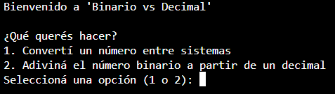

# 📚 Binario vs Decimal

¡Bienvenido a **Binario vs Decimal**!  
Este proyecto es una aplicación de consola en Python, diseñada para practicar y demostrar el uso de **estructuras secuenciales, condicionales y repetitivas** como parte de un trabajo integrador de las asignaturas de Matemáticas y Programación para la Universidad Tecnológica Nacional. 

---

## 🚀 Descripción

El programa ofrece dos modos de juego:

1. **Conversión entre sistemas numéricos**
   - Decimal ↔ Binario ↔ Octal
   - Binario ↔ Decimal ↔ Octal
   - Octal ↔ Decimal ↔ Binario

2. **Adivina el número binario**
   - A partir de un número decimal aleatorio, el usuario debe adivinar su representación en binario.
   - Incluye niveles de dificultad (4 bits o 8 bits).

---

## ⚙️ Funcionalidades principales

- **Estructuras secuenciales:** El flujo normal de ejecución guía al usuario paso a paso.
- **Estructuras condicionales (`if`, `elif`, `else`):** Para tomar decisiones basadas en las entradas del usuario.
- **Estructuras repetitivas (`while`):** Para validar entradas, repetir el juego y realizar cálculos de conversión.

---

## 🎮 Cómo jugar

1. Ejecutá el script:

    ```bash
    python trabajointegradortest.py
    ```

2. Seleccioná el modo de juego:
   - Convertir un número entre sistemas numéricos.
   - Adivinar un número binario a partir de un número decimal.

3. Seguí las instrucciones en pantalla.

4. Al finalizar, podés elegir volver al menú principal o salir del juego.

---

## 📑 Tecnologías usadas

- **Lenguaje:** Python 3
- **Librerías:** `random` (incluida en la biblioteca estándar de Python)

---

## 🛠️ Conceptos aplicados

- Entrada y salida de datos (`input()`, `print()`).
- Validaciones de entrada.
- Operaciones matemáticas básicas para conversiones entre sistemas.
- Formateo de cadenas.
- Uso de bucles anidados.

---

## 📸 Capturas de pantalla



---

## 👨‍💻 Alumnos

- Gabriel Quispe, Natalia Gutierrez, Marcos Manzanelli, Clarisa Morand y Sergio Massazza.

---
